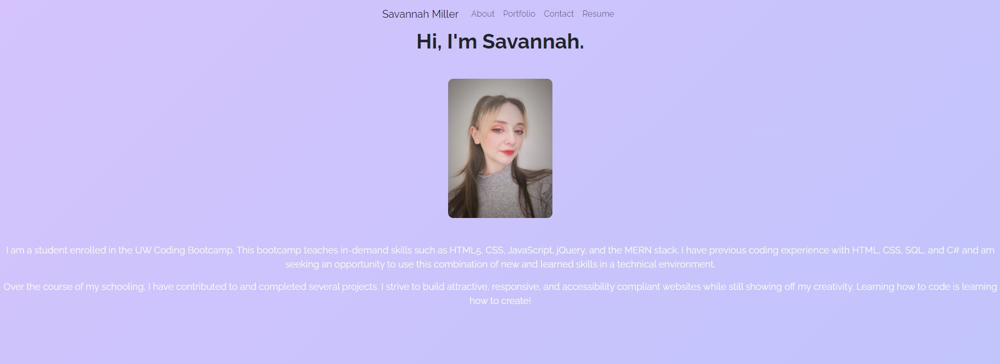

# React Professional Portfolio

## Description

Hello, I'm Savannah! And welcome to my newly redesigned portfolio page. One of our first assignments in the UW Coding Bootcamp was creating a responsive porfolio page to display our projects using HTML and CSS. Now that we've spent time learning the MERN stack, this application has been completely recoded to use React and Bootstrap to create a responsive, clean page to show off my work. Redesigning this application has enforced core concepts using React, such as React Router, Components, JSX, States, and Props. Learning to code in React is a valuable skill as it's used in many major popular apps such as Instagram and Facebook. React is also very flexible, has incredible community support, and uses less code than vanilla Javascript.

## Table of Contents

- [Installation](#installation)
- [Usage](#usage)
- [License](#license)

## Installation

No installation is necessary! You can view my deployed application on Heroku here: 

## Usage

This portfolio page will be used to showcase my most successful and rewarding projects to show potential employers my skillset and work ethic. When you first visit my site, you'll be automatically routed to the About Me page which includes a photo and short bio. The Portfolio page shows cards that include information about my projects and links to the deployed application and the respository. On the Contact Me page, you can send me a message about anything you'd like! Don't worry - if you forget to fill out a field, the site will let you know! If you'd like to see my resume, view the Resume page for a downloadable link and a list of my skills.

## License

MIT License Copyright (c) 2023 VisualViolet